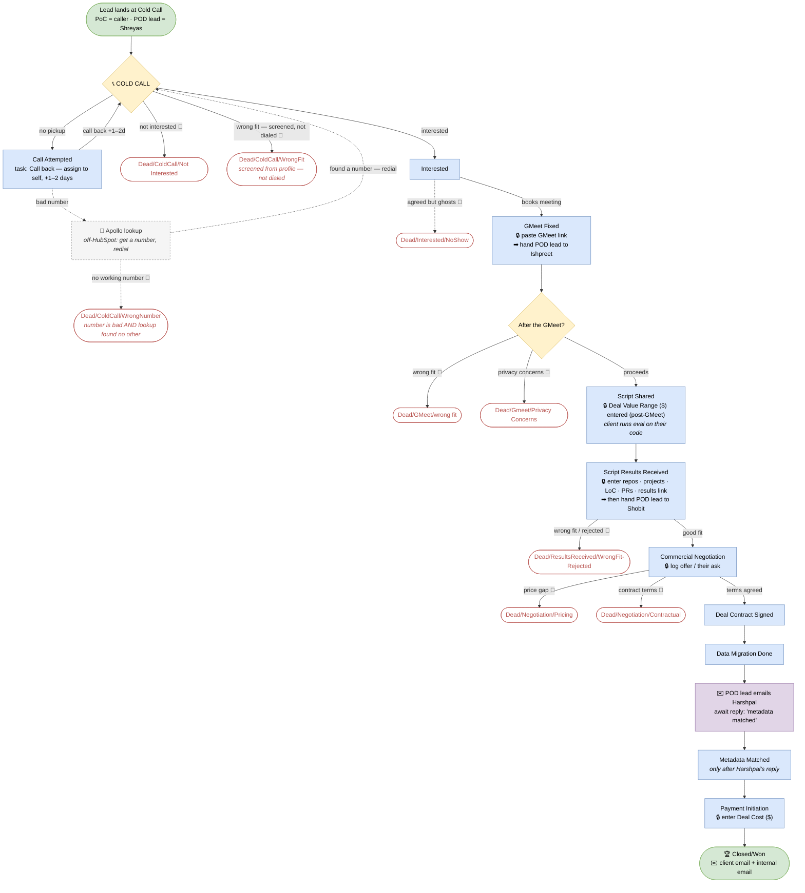

# LH2 Codebase Acquisition — Caller SOP

**Who this is for:** everyone working the **Codebase Acquisition** pipeline in HubSpot — GTM analysts, meeting owners, and closers.
**What we do:** we acquire Indian IT-services firms' **codebases**. A lead travels from a cold call → a technical meeting → a client-run evaluation script → negotiation → contract → data migration → payment → won.

**The rule above all: never make up data.** No number, no name, no answer → leave it blank and note why. A blank is correct; an invented value is a bug.

---

## 1. Two roles on every deal: PoC and POD lead

- **PoC (Point of Contact)** = *the person who made the cold call.* This **never changes** for the life of the deal. It's stored in the **PoC** field on the deal.
- **POD lead** = *whoever is actively driving the deal right now.* This is the **Deal Owner**, and it **changes hands twice** as the deal progresses:

| Phase | POD lead (Deal Owner) | Pool |
|---|---|---|
| Cold Call → GMeet Fixed | **Shreyas** | GTM analysts |
| GMeet Fixed → Script Results Received | **Ishpreet** | Meeting owners |
| Script Results Received → Closed/Won | **Shobit** | Closers |

**Two mandatory handoffs (this is a rule, not a suggestion):**
1. **When you log `GMeet Fixed`:** you MUST (a) paste the **GMeet link** into the deal, and (b) reassign the **Deal Owner → Ishpreet**.
2. **When you log `Script Results Received`:** you MUST reassign the **Deal Owner → Shobit**.

The **PoC stays the same** through all of this — only the POD lead (owner) moves.

---

## 2. The pipeline at a glance

**🔒 = you must fill a field before advancing.** **➡ = a mandatory POD-lead handoff.** **📝 = every Dead/* requires a note (why) before you move the deal there.**

---

## 3. Start of your day

1. **HubSpot → CRM → Deals**, pipeline **Codebase Acquisition**, **Board** view.
2. Filter **Deal owner = you** (that's the POD lead) → save as **"My Deals."**
3. Work **Cold Call** first, then anything with **Next Follow-up = today**.
4. *(Priority is NOT set at this stage — it's set after the GMeet, by the Lead Manager. See below.)*

---

## 4. The cold call — 5 outcomes

| What happened | Move the deal to | Then |
|---|---|---|
| Picked up, interested | **Interested** | (Deal Value Range ($) is entered later — post-GMeet) |
| Picked up, not interested | **Dead/ColdCall/Not Interested** | **note why (required 📝)** |
| Not our target — decided from the profile **before dialing** | **Dead/ColdCall/WrongFit** | **note why (required 📝)**. *No call was made — this is not counted as a call attempt.* |
| No pickup / busy | **Call Attempted** | create a **Call-back task assigned to yourself, due in 1–2 days** |
| Wrong / dead number, **but a lookup finds another** | stay in **Call Attempted** | **Apollo lookup** (Section 8), redial the new number |
| Wrong / dead number **and no other number exists** | **Dead/ColdCall/WrongNumber** | **note what you heard (required 📝)** — *disconnected / different person / wrong company.* Do this only **after** the lookup fails. |

Always **log the call** (Log activity → Call → outcome + one line).

---

## 5. Every stage explained

For each: **what it means → what you do → what to enter → when to move on.** *(Mail templates are marked TBD — use the saved HubSpot template once provided.)*

### 🔵 Cold Call — POD lead: Shreyas
- **Means:** brand-new lead, never contacted. You are the **PoC**.
- **You do:** make the first call.
- **Enter:** call log + outcome.
- **Move on:** Interested / Dead-ColdCall-* / Call Attempted (Section 4).

### 🔵 Call Attempted — POD lead: Shreyas
- **Means:** tried but didn't connect (no pickup / busy), or bad number.
- **You do:** create a **Call-back task assigned to yourself, due in 1–2 days**; Apollo-lookup a bad number first.
- **Move on:** to **Interested** if they engage; to **Dead/ColdCall/Not Interested** (with a note) if they never respond after your attempts; to **Dead/ColdCall/WrongNumber** if the number is genuinely bad and the Apollo lookup turns up nothing else.

### 🔵 Interested — POD lead: Shreyas
- **Means:** they want to know more.
- **You do:** send the meeting invite with the GMeet link.
- **Move on:** → **GMeet Fixed** if they book. If they agreed but then **ghost / never make the meeting**, move to **Dead/Interested/NoShow** (with a note). *(Deal Value Range ($) is NOT entered here — it's captured post-GMeet, once the meeting has clarified scope.)*
- **Mail:** *meeting-invite email with GMeet link — TBD.*

### 🔵 GMeet Fixed — 🔒 + ➡ handoff to Ishpreet
- **Means:** the technical meeting is booked.
- **You do (mandatory):** (1) paste the **GMeet link** into the deal, (2) **reassign Deal Owner → Ishpreet.** The **PoC stays you.**
- **Enter (🔒):** GMeet link (required to enter this stage) + meeting date.
- **On the meeting:** the LH2 side explains the evaluation script.
- **After the call (Lead Manager, now the owner):** **enter the Deal Value Range ($)** and **set the deal Priority (High / Medium / Low)** based on fit/interest — both before moving to Script Shared. *(Priority is set here, post-GMeet — not earlier.)*
- **Move on:** **Script Shared** (they're in), or **Dead/GMeet/wrong fit** / **Dead/Gmeet/Privacy Concerns** (each with a note).

### 🔵 Script Shared — POD lead: Ishpreet
- **Means:** our **evaluation script is sent**. **The client runs it on their own codebase** and returns the output. *(No NDA at this stage — the only signing is the contract after negotiation.)*
- **Enter (🔒):** **Deal Value Range ($)** — entered post-GMeet, required to reach this stage.
- **You do:** follow up until they run it and send results. Set Next Follow-up (+2 days).
- **Move on:** **Script Results Received** when the output is back.

### 🔵 Script Results Received — 🔒 + ➡ handoff to Shobit
- **Means:** we have their script output and LH2 has reviewed code quality.
- **Enter (🔒 — all required *before* the handoff):**
  1. **Number of Repos** in the deal
  2. **Number of Projects** in the deal
  3. **Cumulative LoC** (lines of code)
  4. **Total PRs**
  5. **Script Results link** (the script output link)
- **You do (mandatory, in order):** fill the five fields above → **then reassign Deal Owner → Shobit.** Don't hand off until all five are in.
- **Move on:** **Commercial Negotiation** (good fit) or **Dead/ResultsReceived/WrongFit-Rejected** (with a note).

### 🔵 Commercial Negotiation — POD lead: Shobit
- **Means:** we've made an offer and are negotiating price/terms. *(No more catalogue vs outright — it's one negotiation stage.)*
- **Enter (🔒):** **negotiation notes** — our offer, their ask, where it stands. Required to advance.
- **Move on:** **Deal Contract Signed** (agreed), or **Dead/Negotiation/Pricing** (price gap) / **Dead/Negotiation/Contractual** (contract terms).

### 🔵 Deal Contract Signed — POD lead: Shobit
- **Means:** terms agreed and the contract is signed. **This is the only agreement/contract signing in the whole flow — it happens here, after negotiation, and nowhere earlier.**
- **Move on:** **Data Migration Done**.

### 🔵 Data Migration Done — POD lead: Shobit
- **Means:** their codebase/data has been transferred to us.
- **You do (mandatory):** **email Harshpal** to request the metadata match, and **wait for his reply confirming "metadata matched."**
- **Move on:** **Metadata Matched** — only after Harshpal's confirmation email comes back.

### 🔵 Metadata Matched — POD lead: Shobit
- **Means:** Harshpal has verified the delivered code against the agreed metadata (LoC, repos, PRs, etc.) and **confirmed the match by email.**
- **Enter it only after** that confirmation reply is received.
- **Move on:** **Payment Initiation** once matched.

### 🔵 Payment Initiation — POD lead: Shobit
- **Means:** payment is being processed to the client.
- **Enter (🔒):** the **Deal Cost ($)** field (`cost`) — the amount we're paying the client for the codebase. Required.
- **Move on:** **Closed/Won** once paid.

### 🏆 Closed/Won — POD lead: Shobit
- **Means:** paid, data received and matched. Deal won.
- **You do (mandatory):** send **two emails** —
  1. **Client closure email** — confirm completion / thank-you / handover to the client.
  2. **Internal notification email** — notify the LH2 team the deal is won and delivered.
- **Confirm:** **Deal Cost ($)** is filled (needed for the Executive dashboard's cost-per-100k-LoC).

### 🔴 Dead stages — name = `Dead/{Stage}/{Reason}`
Pick the one that matches where and why it died:

| Died at | Use this dead stage |
|---|---|
| Cold call — picked up, not interested | **Dead/ColdCall/Not Interested** |
| Screened out from profile before dialing | **Dead/ColdCall/WrongFit** |
| Number is dead/wrong and no other number could be found | **Dead/ColdCall/WrongNumber** |
| Said interested but never made the gmeet (ghosted / no-show) | **Dead/Interested/NoShow** |
| GMeet — turned out wrong fit | **Dead/GMeet/wrong fit** |
| GMeet — privacy concerns (won't share code) | **Dead/Gmeet/Privacy Concerns** |
| After results — poor code / rejected | **Dead/ResultsReceived/WrongFit-Rejected** |
| Negotiation — price gap | **Dead/Negotiation/Pricing** |
| Negotiation — contract terms | **Dead/Negotiation/Contractual** |

**Every dead is mandatory-noted 📝** — you must write **one line of why** in the deal notes *before* moving it to any `Dead/*` stage. No note, no dead.

### ⏸️ On Hold (checkbox, not a stage)
Deal alive but paused → tick **On Hold** + set **Next Follow-up**. Keeps its stage, drops off the active board until the date. Don't mark it dead.

---

## 6. Golden rules

1. **Never fabricate.** Blank + reason beats a guess.
2. **PoC never changes. POD lead (owner) changes at the two handoffs.**
3. **No pickup → self-assigned Call-back task, due in 1–2 days.**
4. **Deal Value Range ($) is entered POST-GMeet** (after the meeting), required before Script Shared — not at Interested.
5. **GMeet link required at GMeet Fixed** — and hand the deal to **Ishpreet**.
6. **At Script Results Received: enter # Repos, # Projects, Cumulative LoC, Total PRs, and the Script Results link — then hand the deal to Shobit.** (All five before the handoff.)
7. **Negotiation notes required before Deal Contract Signed.**
8. **After Data Migration Done: email Harshpal, and only move to Metadata Matched once he replies confirming the match.**
8b. **At Payment Initiation: enter the Deal Cost ($).** **At Closed/Won: send the client closure email + the internal notification email.**
9. **Every Dead requires a note (why) before you move there.** Pick the exact `Dead/Stage/Reason`.
10. **Always log the call + set the next follow-up.**
11. **Priority (High/Medium/Low) is set AFTER the GMeet**, by the Lead Manager — not during the cold-call phase.

---

## 7. Example walkthrough — a deal that closes

> *Illustrative. "Acme Software / Priya (founder)" is made up.*

1. **Cold Call** (you = PoC, POD lead Shreyas). Priya's interested → **Interested**. Log call, send the meeting invite.
2. Book the meeting → **GMeet Fixed**: paste GMeet link, **hand owner to Ishpreet.** (PoC still you.)
3. On the GMeet, Priya agrees to run the eval. **Post-call, enter Deal Value Range ₹15L** → **Script Shared**. Ishpreet follows up.
4. Priya's team returns the script output → **Script Results Received**: Ishpreet **updates the results link** and **hands owner to Shobit.**
5. Shobit offers ₹12L, Priya asks ₹18L → **Commercial Negotiation**, notes: *"our ₹12L→₹14L, ask ₹18L, converging ₹15L."*
6. Agreed ₹15L → the **contract is signed here** → **Deal Contract Signed**.
7. Code transferred → **Data Migration Done** → Shobit **emails Harshpal**, Harshpal replies *"metadata matched"* → **Metadata Matched** → payment sent → **Payment Initiation** → **🏆 Closed/Won**.

*(If Priya had privacy concerns about sharing her codebase on the GMeet, you'd move to **Dead/Gmeet/Privacy Concerns** instead.)*

---

## 8. Apollo lookup (wrong / missing number)

Caller-side step, **not a HubSpot stage** — don't move the deal for it.
1. Open the founder's LinkedIn on the contact, or search name + company.
2. Find a working number in **Apollo**.
3. Update the contact's **Phone** in HubSpot.
4. Redial. Deal stays in **Call Attempted** until you connect. If Apollo has nothing, drop a LinkedIn message + set a follow-up — don't guess.

---

## 9. Quick reference card

| Situation | Stage / action |
|---|---|
| New lead | **Cold Call** (you = PoC) |
| Interested | **Interested** (Deal Value Range comes later) |
| No pickup / busy | **Call Attempted** + **Call-back task to self, 1–2d** |
| Bad number | **Call Attempted** + Apollo lookup |
| Meeting booked | **GMeet Fixed** + GMeet link + owner→**Ishpreet** |
| After GMeet call | **enter Deal Value Range ($)** → **Script Shared** |
| Eval running | **Script Shared** |
| Got script output | **Script Results Received** + repos/projects/LoC/PRs/results link → owner→**Shobit** |
| Negotiating | **Commercial Negotiation** + notes |
| Contract signed | **Deal Contract Signed** |
| Data received | **Data Migration Done** → **email Harshpal** |
| Harshpal confirms match | **Metadata Matched** |
| Paying client | **Payment Initiation** |
| Paid + done | **🏆 Closed/Won** |
| Paused | tick **On Hold** + follow-up |
| Died — any stage | pick `Dead/Stage/Reason` + **note why (required)** |

---

## 10. HubSpot how-to

- **Move a stage:** drag the card, or open the deal → change **Deal Stage**. Required fields prompt automatically.
- **Reassign POD lead:** open the deal → change **Deal Owner** to the next person (Ishpreet, then Shobit).
- **PoC:** set once at Cold Call in the **PoC** field — never change it.
- **Log a call / set follow-up / priority / on-hold:** all on the deal record, right panel.
- **Find the founder's contact:** the associated **Contact** holds phone, LinkedIn, email, role.

---

## 11. Mail templates per stage

*To be supplied by the team. Slots reserved:*

| Stage | Mail template |
|---|---|
| Interested → GMeet invite | *TBD (must include the GMeet link)* |
| Script Shared | *TBD (script instructions, if any)* |
| Commercial Negotiation | *TBD (offer email, if any)* |
| Deal Contract Signed | *TBD (contract email, if any)* |
| **Data Migration Done → Harshpal** | *TBD (metadata-match request; reply = "metadata matched" gate)* |
| **Closed/Won → Client** | *TBD (closure / handover / thank-you email)* |
| **Closed/Won → Internal** | *TBD (won + delivered notification to the LH2 team)* |

---

*If a step doesn't match what you see in HubSpot, flag it — don't guess. The pipeline stages in HubSpot exactly match this document.*
