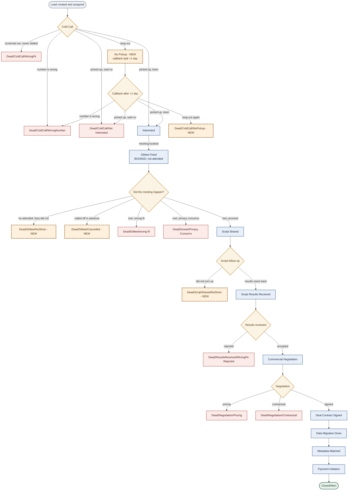

# LH2 Supply Funnel — Stages & Dashboard Metrics

Agreed 5 August 2026. **Nothing in this document has been applied to HubSpot yet.**
Each change is implemented only on explicit instruction, one step at a time.

The governing principle throughout: **the outcome is the stage.** A stage that records only
that something happened, without recording what came of it, cannot be measured — every
result piles into one bucket. Every stage below therefore names a result.

Both pipelines — **Scraped** (`default`) and **Campaign** (`2425754306`) — carry identical
stage labels in identical order. Only the internal stage IDs differ. One design governs both.

---

# 1. Funnel inputs

Five standing sources feed the two pipelines.

| Source | Feeds | What it is |
|---|---|---|
| Private Codebase Tracker | Scraped | IT-services sheet, upstream via service account |
| Tracxn sheet | Scraped | startups, upstream via service account |
| GoodFirms scrape | Scraped | IT services |
| OutFlo outreach | Campaign | startups |
| LinkedIn campaign | Campaign | IT services |

**LinkedIn Sales Navigator** is *not* a standing input. It was a one-off CSV of 49 rows
uploaded on 21 July. The 35 rows that never moved past Cold Call were retired on 5 August;
the 8 that were worked remain.

**Known data gap:** 337 of 1,013 live deals carry no `lead_source` at all, and Tracxn-sourced
deals carry no Tracxn label anywhere. Every funnel count by source is understated until that
is backfilled.

---

# 2. The funnel flow

## Cold-call half

`Cold Call` forks five ways. The outcomes *are* the next stages.

- **screened out, never dialled** → `Dead/ColdCall/WrongFit`
- **number is wrong** → `Dead/ColdCall/WrongNumber`
- **picked up, said no** → `Dead/ColdCall/Not Interested`
- **picked up, keen** → `Interested`
- **rang out** → `No Pickup`

`No Pickup` is a **live** stage, not a dead end. Landing there logs the attempt and raises a
callback task at **+1 day**. It must not be configured as closed-lost, or those leads leave
the open funnel and the callback never gets worked.

The callback repeats the same four outcomes, with `Dead/ColdCall/NoPickup` as the terminal
when it rings out again. Callback and first-dial outcomes converge on the **same** stages —
they are never duplicated per branch.

`Call Attempted` is retired.

## Post-GMeet half

`GMeet Fixed` means **booked**, not attended. It forks:

- **he attended, they did not** → `Dead/GMeet/NoShow`
- **called off in advance** → `Dead/GMeet/Cancelled`
- **met, wrong fit** → `Dead/GMeet/wrong fit`
- **met, privacy concerns** → `Dead/Gmeet/Privacy Concerns`
- **met, proceed** → `Script Shared`

`Script Shared` then forks to `Dead/ScriptShared/NoShow` or `Script Results Received`.

## Diagram

---

# 3. Stage inventory and changes

**Net: 21 stages today → 24.** Five created, two retired.

## To create

| Stage | Type | Purpose |
|---|---|---|
| `No Pickup` | **live — not closed-lost** | holding stage between first dial and callback |
| `Dead/ColdCall/NoPickup` | closed | callback also rang out |
| `Dead/GMeet/NoShow` | closed | booked, prospect did not turn up |
| `Dead/GMeet/Cancelled` | closed | called off in advance |
| `Dead/ScriptShared/NoShow` | closed | script shared, then vanished |

## To retire

| Stage | Live deals | Why |
|---|---:|---|
| `Call Attempted` | 243 | replaced by the outcome stages |
| `Dead/Interested/NoShow` | 13 | collides with `Dead/GMeet/NoShow` — same event |

## Current stages, both pipelines

| # | Stage | Scraped ID | Campaign ID |
|---:|---|---|---|
| 0 | Cold Call | 3992480462 | 4002503379 |
| 1 | Call Attempted | 3992480464 | 4018854632 |
| 2 | Interested | 3992480465 | 4018854633 |
| 3 | GMeet Fixed | 3992480469 | 4018854634 |
| 4 | Script Shared | 3992480471 | 4018854635 |
| 5 | Script Results Received | 3992480473 | 4018854636 |
| 6 | Commercial Negotiation | 4030231231 | 4018854637 |
| 7 | Deal Contract Signed | 4029653710 | 4018854638 |
| 8 | Data Migration Done | 3992480475 | 4018854639 |
| 9 | Metadata Matched | 4036632313 | 4018854640 |
| 10 | Payment Initiation | 4036633274 | 4018854641 |
| 11 | Closed/Won | 4036632309 | 4018854642 |
| 12 | Dead/ColdCall/Not Interested | 4036632310 | 4018854643 |
| 13 | Dead/ColdCall/WrongFit | 4036687547 | 4002503384 |
| 14 | Dead/ColdCall/WrongNumber | 4099250912 | 4099442394 |
| 15 | Dead/Interested/NoShow | 4061963984 | 4002503385 |
| 16 | Dead/GMeet/wrong fit | 4036632311 | 4018854644 |
| 17 | Dead/Gmeet/Privacy Concerns | 4036687548 | 4018854645 |
| 18 | Dead/ResultsReceived/WrongFit-Rejected | 4036687549 | 4018854646 |
| 19 | Dead/Negotiation/Pricing | 4035313388 | 4068768453 |
| 20 | Dead/Negotiation/Contractual | 4036632312 | 4068768454 |

Naming is inconsistent between `Dead/GMeet/wrong fit` and `Dead/Gmeet/Privacy Concerns`.
Renaming a stage moves no deals, so it is safe to correct at the same time.

---

# 4. Dashboard — how every metric is counted

**The counting rule.** Every stage metric counts **how many deals hit that stage that day** —
entered it at any point during the day, not how many are sitting in it now. Read from each
deal's stage-change history, bucketed by **IST** day.

**Filter to `sourceType == "CRM_UI"`.** Roughly 42% of stage-history entries are
`INTEGRATION` — bulk API pushes, including our own. Unfiltered, a bulk import reads as a
record-breaking calling day. `CRM_UI` entries also carry `updatedByUserId`, which gives
per-rep attribution for free and does not depend on who owns the deal.

## GTM analyst panel

| Metric | Counted from |
|---|---|
| Cold-call leads assigned | owner-change history that day |
| Calls attempted | → `WrongNumber`, `Not Interested`, `Interested`, `No Pickup`, `Dead/ColdCall/NoPickup` |
| Calls connected | → `Not Interested`, `Interested` |
| GMeets fixed | → `GMeet Fixed` |

`WrongFit` is excluded from calls attempted — that lead was screened out and never dialled.

## Post-GMeet owner panel

| Metric | Counted from |
|---|---|
| GMeets assigned | owner-change history on deals at `GMeet Fixed` |
| **VCs attended** | → `Dead/GMeet/NoShow`, `Dead/GMeet/wrong fit`, `Dead/Gmeet/Privacy Concerns`, `Script Shared` |
| Scripts shared | → `Script Shared` |
| Script outputs received | → `Script Results Received` |
| Moved to negotiation | → `Commercial Negotiation` |

**Why "attended", not "connected".** The two words measure different things, and the
distinction decides whether a no-show counts. *Connected* would mean both parties spoke — a
no-show plainly fails that. *Attended* measures whether **he** turned up, and on a no-show he
did: he joined the call and waited. That is real time spent, and a metric of his effort has
to include it. `Dead/GMeet/Cancelled` is excluded, because a meeting called off in advance is
time he never spent. That is exactly why NoShow and Cancelled are separate stages — merging
them would make this metric impossible to compute.

## Lead manager panel

| Metric | Counted from |
|---|---|
| Script evaluations conducted | → `Dead/ResultsReceived/WrongFit-Rejected`, `Commercial Negotiation` |

Counting the evaluation *outcome* rather than the `Script Results Received` staging stage
measures that the evaluation actually concluded. It is the lead manager's responsibility to
carry a deal this far.

## Lead closer panel

| Metric | Counted from |
|---|---|
| Script output evaluations conducted | same definition as the lead manager's |
| Deal negotiation calls conducted | → `Dead/Negotiation/Pricing`, `Dead/Negotiation/Contractual`, `Deal Contract Signed` |
| Deals closed | → `Closed/Won` |

The first metric appears on **both** the manager and closer panels deliberately. The two pods
do this work together, so the duplication is intended and should not be "corrected" later.

No new stages are required for the manager or closer panels — every stage already exists.

## Baseline transition counts

Lifetime totals as at 5 August 2026, with CRM_UI-only in brackets. Useful as a sanity check
when the panels first go live.

| Stage | Transitions | via CRM_UI |
|---|---:|---:|
| Script Shared | 52 | 28 |
| Script Results Received | 18 | 12 |
| Dead/ResultsReceived/WrongFit-Rejected | 14 | 12 |
| Commercial Negotiation | 13 | 8 |
| Deal Contract Signed | 8 | 6 |
| Dead/Negotiation/Pricing | 4 | 4 |
| Dead/Negotiation/Contractual | 1 | 0 |
| Closed/Won | 5 | 3 |

---

# 5. Migration blockers and open decisions

## 243 deals are parked on `Call Attempted`

They cannot be sorted automatically — the entire reason for retiring that stage is that it
never recorded which outcome occurred.

| Owner | Scraped | Campaign | Total | Has notes | Has tasks |
|---|---:|---:|---:|---:|---:|
| Shreyas Boosnoor | 122 | 0 | 122 | 18 | 27 |
| Yuktha Anand | 38 | 5 | 43 | 42 | 14 |
| Yash Wani | 17 | 16 | 33 | 31 | 21 |
| Lamiya Saleem | 31 | 1 | 32 | 11 | 31 |
| Ishpreet Sood | 8 | 1 | 9 | 4 | 1 |
| (unassigned) | 4 | 0 | 4 | 3 | 1 |
| **Total** | **220** | **23** | **243** | **109** | **95** |

**109 have notes that do say what happened** — "number out of service", "megha busy Ashutosh
wrong number", "automated call inbox". Those can be triaged into real outcome stages.
**91 have neither note nor task**, and for those there is nothing to recover; `No Pickup` is
the honest destination. Shreyas holds 122 of the 243, so this is mostly a decision about his
queue.

These deals are **not stale** — 18 were touched today and 122 within three days. This is the
team's active working set, not an abandoned pile, so a blind bulk move would reclassify
conversations that are still live.

## Open decisions

1. **Retire `Dead/Interested/NoShow`?** It means the same thing as the new
   `Dead/GMeet/NoShow`. Keeping both splits one number across two stages.
2. **Does `Dead/ScriptShared/NoShow` count toward VCs attended?** Yes if a follow-up call is
   booked after the script goes out; no if the script is simply emailed. Currently excluded.
3. **Destination for the 243.**

## Known measurement limits

- **Calls attempted is a floor, not a dial count.** A repeat dial on a deal that does not
  change stage produces no transition and is invisible. The portal contains **2 logged call
  engagements in total** (14 July, no owner, disposition or duration) — HubSpot's call object
  is effectively unused. The only real fix is logging calls.
- **The migration will break the time series.** `Call Attempted` disappears but remains in
  history. Map historical `Call Attempted` → `No Pickup` for continuity and mark the boundary.
- **Unknown stage IDs already appear in history** (for example `3992480479`, a deleted
  stage). The metric code must skip them rather than crash or mislabel.
- **A later no-show must not retroactively decrement** the day a GMeet was booked.
- **57 of 92 open tasks are already past due.** The callback discipline the new flow depends
  on is not currently being kept, and `No Pickup` only works if the +1 day task gets worked.
