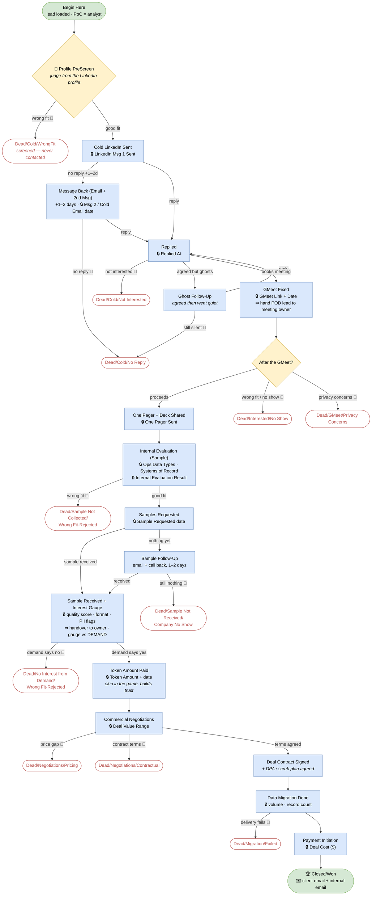

# LH2 Company Ops-Data Acquisition — GTM SOP

**Who this is for:** everyone working the **Company Ops Data** pipeline in HubSpot (portal `246897735`) — GTM analysts, meeting owners, and closers.

**What we buy:** a company's **internal operating know-how / ops data** — the reusable blueprint for *running* that kind of business: SOPs, playbooks, process docs, internal tooling & workflows, org structure, vendor/ops setup and operational records.

**What we do NOT buy here:** codebases (that's the other pipeline/portal) and consumer/product analytics.

**This line starts on LinkedIn, not the phone.** Entry is a cold LinkedIn message; the phone only appears as a follow-up channel.

> ### ⚠️ Open item — where cold leads come from is **not decided yet**
> This SOP covers everything **from the moment a lead is in HubSpot at `Begin Here`**. How that list gets *built* — scraped, bought, sourced from a directory, exported from Tracxn/LinkedIn Sales Navigator, or hand-picked — is **still to be defined**.
> **Until it is:** work only the leads loaded into the pipeline for you, and don't self-source. Once the sourcing method is agreed, it gets documented here and the `Lead Source` field on the deal must be filled on every lead.

**The rule above all: never make up data.** No number, no name, no answer → leave it blank and note why. A blank is correct; an invented value is a bug.

---

## 1. Roles: PoC and POD lead

- **PoC (Point of Contact)** = *the analyst who sent the first LinkedIn message.* This **never changes** for the life of the deal (field: **PoC**).
- **POD lead** = *whoever is driving the deal right now* = the **Deal Owner**. It changes hands as the deal matures.

| Phase | POD lead (Deal Owner) | Pool |
|---|---|---|
| Begin Here → GMeet Fixed | outreach analyst | GTM |
| GMeet Fixed → Sample Received | meeting owner | Meeting owners |
| Sample Received → Closed/Won | closer | Closers |

> **Today this portal has one user — Kartik Pillai.** Until more seats are added, Kartik is PoC *and* POD lead at every phase; keep the **PoC** field filled anyway, so the handoffs work the moment the team grows.

**Mandatory handoffs (rules, not suggestions):**
1. **At `GMeet Fixed`:** paste the **GMeet Link** + **GMeet Date** into the deal, then reassign **Deal Owner → meeting owner**.
2. **At `Sample Received + Interest Gauge`:** the sample is handed to the **owner** to gauge against demand — fill the sample fields **before** the handoff.

The **PoC stays the same** through all of it.

---

## 2. The pipeline at a glance

**🔒 = fill the field before advancing.** **➡ = mandatory handoff.** **📝 = every `Dead/*` needs a one-line note (why) before you move it.**

---

## 3. Start of your day

1. **HubSpot → CRM → Deals**, pipeline **Company Ops Data**, **Board** view.
2. Filter **Deal owner = you** → save as **"My Deals."**
3. Work in this order:
   1. **Replied** (hottest — a human is waiting on you)
   2. **Sample Follow-Up** and **Samples Requested** (deals stall and die here)
   3. **Message Back** / **Ghost Follow-Up** due today
   4. **Begin Here / Profile PreScreen** (new leads)
4. Anything with **Next Follow-up = today** gets touched today.

---

## 4. The outreach sequence — timings

| Step | When | Channel |
|---|---|---|
| **Msg 1** — cold LinkedIn | day 0 | LinkedIn |
| **Message Back** — cold email **+ 2nd LinkedIn message** | **+1–2 days** after no reply | Email + LinkedIn |
| **Ghost Follow-Up** — they agreed, then went quiet | **+1–2 days** after silence | LinkedIn/email/call |
| **Sample Follow-Up** — sample not received | **+1–2 days** after the request | **Email + call back** |

Two silent touches on the cold sequence, then **Dead/Cold/No Reply**. Don't chase past that — log it and move on.

---

## 5. Every stage explained

### 🔵 Begin Here
- **Means:** lead is loaded in the pipeline, nothing sent yet. You are the **PoC**.
- **Enter:** PoC (+ **Lead Source** once sourcing is defined — see the open item at the top).
- **Move on:** → Profile PreScreen.

### 🔎 Profile PreScreen
- **Means:** judge fit **from the LinkedIn profile / company page — before contacting.**
- **Look for:** did they actually *run an operation*? Real headcount, multi-city/field ops, logistics, delivery, fulfilment, commerce/inventory, manufacturing, lending-collections, healthcare-delivery. Pure-software/SaaS with no operation → wrong fit (that's the codebase line).
- **Enter (🔒):** **PreScreen Result** (Good Fit / Wrong Fit).
- **Move on:** Good fit → **Cold LinkedIn Sent**. Wrong fit → **Dead/Cold/WrongFit** 📝 *(no message was sent — this is not an outreach attempt).*

### 🔵 Cold LinkedIn Sent
- **Means:** msg 1 is out.
- **Enter (🔒):** **LinkedIn Msg 1 Sent** date. Set **Next Follow-up = +1–2 days**.
- **Move on:** reply → **Replied**. Silence after 1–2 days → **Message Back**.

### 🔵 Message Back (Email + 2nd Msg)
- **Means:** the second touch — **cold email *and* a second LinkedIn message.**
- **Enter (🔒):** **LinkedIn Msg 2 Sent** and/or **Cold Email Sent**; bump **Follow-Up Count**.
- **Move on:** reply → **Replied**. Still silent → **Dead/Cold/No Reply** 📝.

### 🔵 Replied
- **Means:** they responded and there's a conversation.
- **Enter (🔒):** **Replied At**.
- **You do:** qualify + push for a GMeet.
- **Move on:** books a meeting → **GMeet Fixed**. Not interested → **Dead/Cold/Not Interested** 📝. Agreed then went quiet → **Ghost Follow-Up**.

### 🔵 Ghost Follow-Up
- **Means:** they said yes, then stopped replying.
- **You do:** one more nudge after 1–2 days.
- **Move on:** replies → back to **Replied**. Still silent → **Dead/Cold/No Reply** 📝.

### 🔵 GMeet Fixed — 🔒 + ➡ handoff
- **Means:** the meeting is booked.
- **Enter (🔒):** **GMeet Link** + **GMeet Date**, then reassign **Deal Owner → meeting owner**. PoC stays you.
- **On the call:** understand what they ran, what systems hold the data, what documentation exists — and **surface privacy early** (this is the #1 objection on this line).
- **After the call (🔒):** set **GMeet Outcome** (Proceeds / Wrong Fit / Privacy Concerns / No Show).
- **Move on:** Proceeds → **One Pager + Deck Shared**. Wrong fit or no-show → **Dead/Interested/No Show** 📝. Won't share data on privacy grounds → **Dead/GMeet/Privacy Concerns** 📝.

### 🔵 One Pager + Deck Shared
- **Means:** we've sent **our one-pager + company deck** so they can see who we are and what we buy.
- **Enter (🔒):** **One Pager Sent** date. When their filled one-pager comes back, set **One Pager Received**.
- **Move on:** → **Internal Evaluation (Sample)**.

### 🔵 Internal Evaluation (Sample)
- **Means:** **we** decide internally whether their ops data is worth collecting a sample of.
- **Enter (🔒):** **Ops Data Types** (SOPs & playbooks, process docs, internal tooling, CRM records, transactions, logistics, inventory, HR/org, vendor…), **Systems of Record**, and where known **Record Count**, **Data Covers From/To**, **Data Format**, **SOP Docs Available**.
- **Enter (🔒):** **Internal Evaluation Result** (Good Fit / Wrong Fit - Rejected).
- **Move on:** Good fit → **Samples Requested**. Wrong fit → **Dead/Sample Not Collected/Wrong Fit-Rejected** 📝.

### 🔵 Samples Requested
- **Means:** we've asked them for a **redacted sample extract**.
- **Enter (🔒):** **Sample Requested** date. **Next Follow-up = +1–2 days.**
- **Say this:** sample should be **representative, redacted, small** — enough to judge structure and quality, not the full set.
- **Move on:** arrives → **Sample Received + Interest Gauge**. Nothing → **Sample Follow-Up**.

### 🔵 Sample Follow-Up
- **Means:** chasing the sample — **email + call back**, 1–2 days.
- **Enter:** bump **Follow-Up Count**.
- **Move on:** arrives → **Sample Received + Interest Gauge**. Still nothing → **Dead/Sample Not Received/Company No Show** 📝.

### 🔵 Sample Received + Interest Gauge — 🔒 + ➡ handover
- **Means:** the sample is in, and it goes to the **owner to gauge against DEMAND** (do our buyers actually want this?).
- **Enter (🔒, before the handover):** **Sample Received** date · **Sample Format** · **Sample Quality Score (0–100)** · **Completeness %** · **PII Present** · **PII Scrub Required** · **Interest Gauge** (Strong / Moderate / Weak / Wrong Fit - Rejected).
- **Move on:** demand says yes → **Token Amount Paid**. Demand says no → **Dead/No Interest from Demand/Wrong Fit-Rejected** 📝.

### 🔵 Token Amount Paid
- **Means:** **we pay a token amount** once the sample is in — it builds trust and puts **skin in the game on both sides.** This is unique to this line.
- **Enter (🔒):** **Token Amount Paid (USD)** + **Token Paid At**.
- **Move on:** → **Commercial Negotiations**.

### 🔵 Commercial Negotiations
- **Means:** price and scope for the full data set.
- **Enter (🔒):** **Deal Value Range ($)**; keep **Compliance / DPA Notes** current (restrictions, jurisdiction, what must be scrubbed).
- **Move on:** agreed → **Deal Contract Signed**. Price gap → **Dead/Negotiations/Pricing** 📝. Terms → **Dead/Negotiations/Contractual** 📝.

### 🔵 Deal Contract Signed
- **Means:** purchase agreement **+ DPA** signed, and the **PII scrub plan is agreed in writing** (what's removed/anonymised before it reaches us).
- **Move on:** → **Data Migration Done**.

### 🔵 Data Migration Done
- **Means:** the full data set has been transferred to us and checked.
- **Enter (🔒):** **Data Volume (GB)**, final **Record Count**, **Data Migration Done At**; confirm the scrub was applied.
- **Move on:** → **Payment Initiation**. If delivery collapses (can't extract, scrub blocked, data not as promised) → **Dead/Migration/Failed** 📝.

### 🔵 Payment Initiation
- **Means:** the balance payment is being processed.
- **Enter (🔒):** **Deal Cost (USD)** — total we pay for the data (the token counts toward it) + **Payment Initiated At**.
- **Move on:** → **Closed/Won** once paid.

### 🏆 Closed/Won
- **Means:** paid and delivered. **Send the client closure email + the internal notification email.**
- **Confirm:** Deal Cost, Data Volume, Record Count and Ops Data Types are all filled — that's what the dashboard reports on.

---

## 6. 🔴 Dead stages — `Dead/{Stage}/{Reason}`

| Died at | Use this |
|---|---|
| Screened from the profile, never contacted | **Dead/Cold/WrongFit** |
| Replied, not interested | **Dead/Cold/Not Interested** |
| Never replied after 2 touches, or ghosted and stayed silent | **Dead/Cold/No Reply** |
| Agreed but no-showed / wrong fit at the meeting | **Dead/Interested/No Show** |
| Won't share data — privacy/legal | **Dead/GMeet/Privacy Concerns** |
| Internal evaluation says not worth sampling | **Dead/Sample Not Collected/Wrong Fit-Rejected** |
| Sample never arrived after follow-up | **Dead/Sample Not Received/Company No Show** |
| Sample came, but demand doesn't want it | **Dead/No Interest from Demand/Wrong Fit-Rejected** |
| Price gap | **Dead/Negotiations/Pricing** |
| Contract terms | **Dead/Negotiations/Contractual** |
| Delivery failed after contract | **Dead/Migration/Failed** |

**Every dead is mandatory-noted 📝** — one line of *why*, in the deal notes, **before** you move it. No note, no dead.

---

## 7. Golden rules

1. **Never fabricate.** Blank + reason beats a guess.
2. **PoC never changes. POD lead (owner) moves at GMeet Fixed and at Sample Received.**
3. **PreScreen before you message** — set **PreScreen Result**; wrong fits never get contacted.
4. **Two silent touches, then dead.** Msg 1 → (+1–2d) Message Back → **Dead/Cold/No Reply**.
5. **GMeet Link + Date are required at GMeet Fixed** — then hand the deal over.
6. **Raise privacy early**, on the GMeet — not after the sample request. It's the top killer on this line.
7. **Samples are redacted and representative** — never ask for the full set before contract.
8. **Fill quality score, completeness, PII flags and Interest Gauge before the demand handover.**
9. **Token is paid only after the sample is in** and demand is positive — never before.
10. **No data moves before the contract + DPA**, and the **scrub plan is agreed in writing**.
11. **Deal Cost ($) at Payment Initiation; both emails at Closed/Won.**
12. **Every Dead needs a note.** Pick the exact `Dead/Stage/Reason`.
13. **Always log the activity + set the next follow-up.**

---

## 8. Example walkthrough — a deal that closes

> *Illustrative. "Metro Logistics / Anil (founder)" is made up.*

1. **Begin Here** (you = PoC). Profile shows a 120-person multi-city delivery operation → **PreScreen = Good Fit** → **Cold LinkedIn Sent** (Msg 1 logged, follow-up +2d).
2. Silence → **Message Back**: cold email + 2nd LinkedIn message. Anil replies → **Replied**.
3. He books a call → **GMeet Fixed**: paste link + date, **hand owner to the meeting owner**. On the call he asks about customer data — privacy is addressed up front; he's fine with a redacted sample. **GMeet Outcome = Proceeds.**
4. **One Pager + Deck Shared** → he returns it → **Internal Evaluation (Sample)**: Ops Data Types = *SOPs & playbooks, logistics/delivery, vendor*; Systems = *custom TMS + Tally*; **Result = Good Fit**.
5. **Samples Requested** → nothing in 2 days → **Sample Follow-Up** (email + call) → sample lands → **Sample Received + Interest Gauge**: quality 78, completeness 60%, **PII present → scrub required**, **Interest Gauge = Strong** → handover to owner.
6. Demand says yes → **Token Amount Paid** ($500, logged) → **Commercial Negotiations** (Deal Value Range $8–12k) → agreed → **Deal Contract Signed** (DPA + scrub plan).
7. Full set transferred, scrub verified → **Data Migration Done** (42 GB, 1.2M records) → **Payment Initiation** (Deal Cost $10k) → **🏆 Closed/Won** + client and internal emails.

*(If demand had come back cold at step 6, it's **Dead/No Interest from Demand/Wrong Fit-Rejected** — and we'd still have paid nothing, because the token comes after the gauge.)*

---

## 9. Quick reference card

| Situation | Stage / action |
|---|---|
| New lead loaded | **Begin Here** (set PoC) |
| Judged from profile | **Profile PreScreen** + PreScreen Result |
| Not our target, never messaged | **Dead/Cold/WrongFit** 📝 |
| Msg 1 sent | **Cold LinkedIn Sent** + Msg 1 date, follow-up +1–2d |
| No reply after 1–2d | **Message Back** (email + 2nd msg) |
| Still no reply | **Dead/Cold/No Reply** 📝 |
| They replied | **Replied** + Replied At |
| Agreed then quiet | **Ghost Follow-Up** |
| Meeting booked | **GMeet Fixed** + link + date + **hand over** |
| Meeting went well | **One Pager + Deck Shared** |
| Deciding if worth sampling | **Internal Evaluation (Sample)** + data types/systems |
| Asked for sample | **Samples Requested** + date, follow-up +1–2d |
| Chasing the sample | **Sample Follow-Up** (email + call) |
| Sample in | **Sample Received + Interest Gauge** + quality/PII/gauge → **hand over** |
| Demand says yes | **Token Amount Paid** + amount + date |
| Talking price | **Commercial Negotiations** + Deal Value Range |
| Signed (+DPA) | **Deal Contract Signed** |
| Data transferred | **Data Migration Done** + volume + records |
| Paying | **Payment Initiation** + Deal Cost ($) |
| Paid + done | **🏆 Closed/Won** + both emails |
| Died anywhere | `Dead/Stage/Reason` + **note why** 📝 |

---

## 10. HubSpot how-to

- **Portal:** `246897735` · **Pipeline:** *Company Ops Data* (`2464812771`).
- **Move a stage:** drag the card, or open the deal → **Deal Stage**.
- **Reassign POD lead:** open the deal → change **Deal Owner**.
- **PoC:** set once at Begin Here — never change it.
- **Log activity / follow-up / notes:** deal record, right panel.
- **Contact fields** (LinkedIn URL, role, SPOC type, Outreach Status) live on the associated **Contact**.

## 11. Mail / message templates

*To be supplied by the team. Slots reserved:*

| Step | Template |
|---|---|
| LinkedIn Msg 1 (cold) | TBD |
| Cold email + LinkedIn Msg 2 | TBD |
| Ghost follow-up | TBD |
| Meeting invite | TBD |
| One-pager + deck email | TBD |
| Sample request | TBD |
| Sample follow-up (email + call script) | TBD |
| Token / contract covering note | TBD |
| Client closure email | TBD |
| Internal notification email | TBD |
