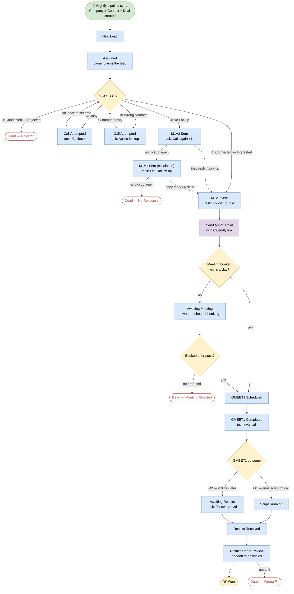
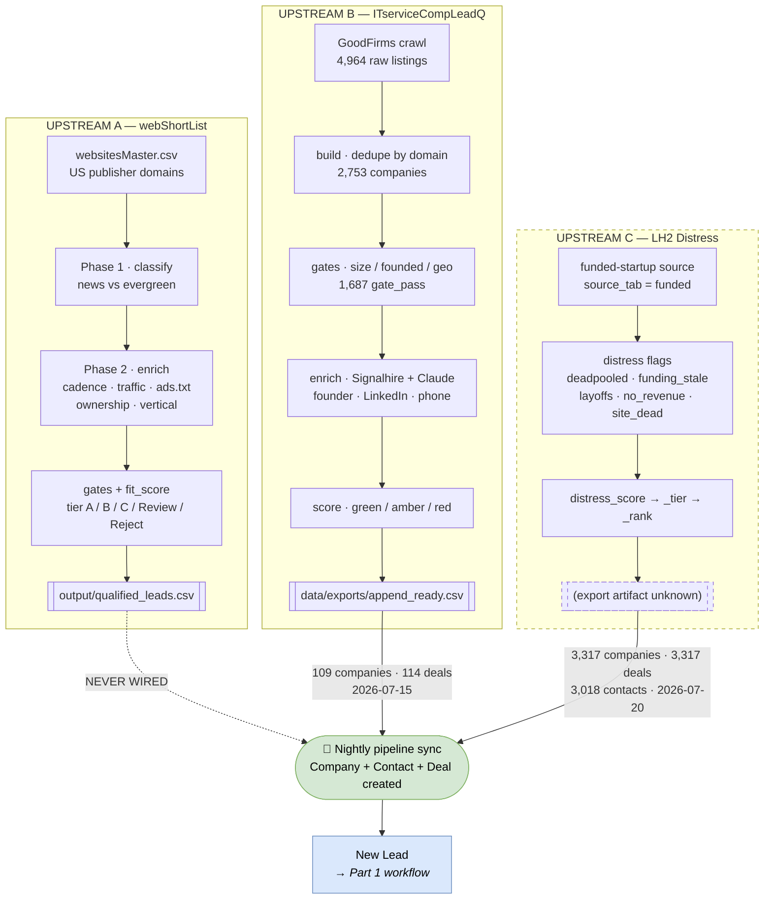

# PART 1 — Verbatim reproduction of `SALES_WORKFLOW_FLOWCHART.pdf`

> Everything in Part 1 is a faithful transcription of the PDF. Part 2 (below the rule) is new
> analysis mapping this workflow onto the upstream pipelines.

---

## Codebase Acquisition — Sales Workflow (start → end)

One diagram, every scenario. Renders automatically on GitHub. To get an image for slides: copy the `mermaid` block into **https://mermaid.live** → Actions → Export PNG/SVG.

**Legend:** 🔵 pipeline stage · 🟠 decision · 🔴 dead end · 🟡 won · **solid arrow** = normal path · **dotted arrow** = "they came back / picked up". Outcomes ①–⑤ and their stage moves + tasks are **automated** by `lh2 hubspot-call-outcome`; everything after the M1V1 email is a **manual** stage move in HubSpot.

### The 5 cold-call outcomes at a glance (what the tool does for you)

| # | Situation | Deal moves to | Auto-task |
|---|---|---|---|
| ① | Picked up, interested | **M1V1 Sent** | Follow up — no meeting booked (+1 day) |
| ② | Picked up, hard rejection | **Dead — Rejected** | — (closed lost) |
| ③ | Picked up, busy | **Call Attempted** | Callback (at given time, else next day) |
| ④ | Wrong number | **Call Attempted** | Apollo lookup (today) → fix & retry |
| ⑤ | No pickup | **M1V2 Sent** → escalate → **Dead — No Response** | Call again → Final follow-up |

### Two nuances for the team

- **Escalation (⑤):** no-pickup once → M1V2 email; no-pickup again → M1V1 email (escalation); no-pickup a third time → Dead — No Response. If they reply/pick up at any point, you jump into the interested flow (M1V1 Sent).
- **Retries (③ ④):** Busy and Wrong-Number keep the deal alive in *Call Attempted* — you loop back and call again once the time comes / number is fixed.

> The pipeline also has two optional manual stages not shown as auto-steps — **Call Connected** (an intermediate you can use before M1V1) — the automated flow skips straight to *M1V1 Sent* on an interested call.

*(Transcription note: the sentence above says "two optional manual stages" but names only one. Verbatim as printed.)*

---
---

# PART 2 — Mapping to the upstream funnels

Everything in Part 1 begins at **🔄 Nightly pipeline sync**. Part 2 documents what happens *before* that node — the three upstream lead-generation funnels that produce the Company + Contact + Deal records.

**Portal:** 246754894 (`na2`, STANDARD) · **Live as of 2026-07-21:** 3,811 companies · 3,231 contacts · 3,432 deals
**Dedupe key:** `lh2_domain` (unique on Company and Deal) · **Sync bookkeeping:** `pipeline_source`, `source_tab`, `pipeline_synced_at`

## 2.1 Where the sync node gets its records

## 2.2 Which upstream lands in which pipeline

| Upstream | `pipeline_source` | `source_tab` | Deal pipeline | Volume | Last sync |
|---|---|---|---|---:|---|
| ITserviceCompLeadQ | `LH2 pipeline` | *(blank)* | **Codebase Acquisition** (`default`) | 109 co / 114 deals | 2026-07-15 |
| LH2 Distress | `LH2 Distress` | `funded` | **Startups-Founders** (`2425754306`) | 3,317 co / 3,317 deals / 3,018 contacts | 2026-07-20 |
| webShortList | — | — | — | **0** | never |

Both pipelines carry the identical 18 stages, so the Part 1 workflow applies to both. The PDF is titled for Codebase Acquisition because that is the only pipeline where deals have actually moved.

## 2.3 Field mapping — upstream artifact → HubSpot property

**Upstream B (ITserviceCompLeadQ), `append_ready.csv` → HubSpot.** Inferred from column/property correspondence; the sync code is not on this machine, so this is a reconstruction, not a verified mapping.

| CSV column | HubSpot object | Property |
|---|---|---|
| *(derived registered domain)* | Company + Deal | `lh2_domain` *(dedupe key)* |
| Company | Company | `name` |
| Founder(s) | Contact | `firstname` / `lastname`, `spoc_type=Primary` |
| Founder LinkedIn (verified) | Contact | `linkedin_url` |
| Contact Number | Contact | `phone` |
| SPOC 2 Linkedin | Contact | second contact, `spoc_type=Secondary` |
| Incorp. Year | Company | *(no matching custom property found)* |
| HQ / India delivery | Company | `city` / `hq_country` |
| Approx. Headcount | Company | `size_bucket` |
| Headcount source (approx.) | Company | `headcount_source` |
| Segment | Company | `segment` |
| Notes | Company | `pipeline_notes` |
| — | Company | `pipeline_source`, `source_tab`, `pipeline_synced_at` |

**Upstream C (LH2 Distress) → HubSpot.** The distress block is written to **both** Company and Deal, so scoring travels with the deal: `distress_score`, `distress_tier`, `distress_rank`, `distress_flags`, `distress_reasons`, `funding_status`, and seven `flag_*` booleans — `flag_deadpooled`, `flag_funding_stale`, `flag_funding_aging`, `flag_layoff_or_shutdown`, `flag_negative_profit`, `flag_no_revenue`, `flag_website_dead`, `flag_tiny_headcount`. Deals additionally carry `lh2_distress_key`.

**Upstream A (webShortList) → HubSpot.** No mapping exists. Its natural targets would be `tier` → a new deal/company property, `fit_score` → a numeric score, and `vertical` / `cadence` / `monthly_visits` / `us_share_pct` / `ad_network` / `ownership` → new custom properties. **None of these exist in the portal today.**

## 2.4 Deal properties that back the Part 1 workflow

The existing deal schema maps one-to-one onto the cold-call decision tree — good evidence the automation was built against it:

| Part 1 element | Deal property |
|---|---|
| COLD CALL outcomes ①–⑤ | `call_outcome`, `call_attempt_count` |
| ③ Busy → Callback task | `callback_datetime` |
| ④ Wrong Number → Apollo lookup | `needs_number_lookup` |
| M1V1 / M1V2 escalation | `email_version_sent` |
| Send M1V1 email with Calendly link | `calendly_link_sent` |
| GMEET1 Scheduled / Completed / outcome | `gmeet1_date`, `gmeet1_link`, `gmeet1_outcome` |
| Script Running → Results Received | `script_status`, `script_link`, `script_output_link` |
| Results Under Review → Won | `deal_value_range`, `eval_results` (Company) |
| Call notes throughout | `call_notes`, `call_outcome` (also on Contact) |

## 2.5 Live stage distribution vs. the Part 1 flow

### Codebase Acquisition — 114 deals

| Stage | Deals |
|---|---:|
| New Lead | 24 |
| Assigned | 5 |
| Call Attempted | 31 |
| Call Connected | 10 |
| M1V1 Sent | 10 |
| M1V2 Sent | 0 |
| Awaiting Meeting | 1 |
| GMEET1 Scheduled | 0 |
| GMEET1 Completed | 0 |
| Script Running | 1 |
| Awaiting Results | 2 |
| Results Received | 1 |
| Results Under Review | 1 |
| **Won** | **0** |
| Dead — Rejected | 9 |
| Dead — No Response | 7 |
| Dead — Meeting Rejected | 0 |
| Dead — Wrong Fit | 12 |

Three observations against the Part 1 flow:

1. **`Call Attempted` (31) is the largest live bucket, but it is a holding pen, not progress.** Per Part 1 it holds outcomes ③ and ④ awaiting a callback or an Apollo number fix. These deals are parked, not advancing.
2. **`M1V2 Sent` = 0 while `Dead — No Response` = 7.** The ⑤ escalation chain is not being recorded stage-by-stage — no-pickups reach dead without passing through either email escalation.
3. **`Dead — Wrong Fit` = 12 is unreachable per the flow.** Wrong Fit is only entered from *Results Under Review*, yet just 5 deals ever reached the results stages. Those 12 were set manually as a catch-all.

`Call Connected` = 10 is consistent with Part 1: it is the optional manual stage the automation skips.

### Startups-Founders — 3,318 deals

| Stage | Deals |
|---|---:|
| **New Lead** | **3,312** |
| Call Attempted | 1 |
| Call Connected | 3 |
| Results Under Review | 1 |
| Dead — Rejected | 1 |
| all other stages | 0 |

99.8% have never been assigned, let alone called — the entire LH2 Distress load is sitting at the first node of the Part 1 flow.

## 2.6 What is missing on this laptop

| Component | Status |
|---|---|
| `lh2 hubspot-call-outcome` (automates ①–⑤) | **Absent** |
| Nightly pipeline sync (creates Company + Contact + Deal) | **Absent** |
| LH2 Distress pipeline (3,317 records) | **Absent** |
| Apollo integration (④ number lookup) | **Absent** |
| Calendly / M1V1 · M1V2 email templates | **Absent** |
| webShortList → HubSpot sync | **Never existed** |

The local `lh2` CLI ([cli.py](../ITserviceCompLeadQ/src/lh2_pipeline/cli.py)) defines only `version`, `init`, `config-check`, `crawl`, `smoke`, `build`, `enrich`, `score`, `export`, `run`. A grep across the entire source tree for `hubspot`, `apollo`, `calendly`, `m1v1`, `m1v2` returns nothing. The previous machine's copy is ahead by an entire HubSpot integration module.

## 2.7 Data integrity rule (carried from both upstreams)

Both local pipelines enforce **never fabricate**: any signal that cannot be obtained is marked `unknown` and routed to a Review tier — never silently passed or rejected. Any HubSpot sync must carry this through. **A blank property is correct; an invented one is a bug.**

---
---

# PART 3 — Codebase Acquisition (IT-services) — REVISED FLOW

> **⚠ SUPERSEDED by v3 (2026-07-23) — now LIVE in HubSpot.** The authoritative operational
> doc is **[CALLER_SOP.md](CALLER_SOP.md)**. The sections below (§3.1–§3.7) are the earlier v2
> design and are kept for history; the **current live pipeline is the 19 stages below.**
>
> **Live stages (12 open + 7 dead), in order:**
> Cold Call → Call Attempted → Interested → GMeet Fixed → Script Shared → **Script Results Received**
> → **Commercial Negotiation** → **Deal Contract Signed** → **Data Migration** → **Metadata Matching**
> → **Payment Initiation** → **Closed/Won**.
> Dead: `Dead/ColdCall/Not Interested`, `Dead/ColdCall/WrongFit`, `Dead/ColdCall/WrongNumber`,
> `Dead/GMeet/wrong fit`,
> `Dead/Gmeet/Privacy Concerns`, `Dead/ResultsReceived/WrongFit-Rejected`,
> `Dead/Negotiation/Pricing`, `Dead/Negotiation/Contractual`.
>
> **v3 changes vs v2:** Results Received → **Script Results Received**; Offer Sent + Negotiation
> merged into **Commercial Negotiation**; catalogue/outright dropped entirely (no `offer_type`);
> the former "NDA / Agreement Signed" stage renamed **Deal Contract Signed** (the single signing, after negotiation — no NDA earlier); Payment & Data Received split into
> **Data Migration → Metadata Matching → Payment Initiation → Closed/Won**; dead-ends renamed to
> the `Dead/{Stage}/{Reason}` convention.
>
> **Roles:** **PoC** = the cold caller (fixed, `poc` field). **POD lead** = Deal Owner, changes at
> two handoffs — Shreyas (Cold Call→GMeet Fixed) → Ishpreet (GMeet Fixed→Script Results Received)
> → Shobit (Script Results Received→Closed/Won). At GMeet Fixed: paste GMeet link + hand to Ishpreet.
> At Script Results Received: hand to Shobit.

## 3.1 Live design → see CALLER_SOP.md

The earlier v2 design that used to fill this section (its flowchart, stage table, the
**NDA-at-GMeet gate**, the catalogue/outright offer split, and the open questions) is **superseded
and has been removed** so nothing here contradicts the live pipeline. The authoritative, current
operational spec is **[CALLER_SOP.md](CALLER_SOP.md)**, matching the live 19-stage HubSpot pipeline
summarised in the banner above.

Key correction carried into v3: **there is no NDA / agreement signing at the GMeet or Script stage.**
The only contract signing is **Deal Contract Signed**, which comes **after Commercial Negotiation**.

**Still-to-create HubSpot properties** (deal-level unless noted; `incorp_year` already created):
`metadata_link` (URL), `action_items`, `reachout_date` (date), `next_follow_up_date` (date),
`negotiation_notes`, `on_hold` (checkbox). Reuse built-in `hs_priority` for hot/warm/cold.
**No `offer_type`** — catalogue/outright was dropped entirely.

**🔒 gates to wire when ready:** Deal Value required at Interested; GMeet link required at GMeet Fixed;
negotiation notes required to leave Commercial Negotiation. (Currently SOP rules, not yet enforced in HubSpot.)
