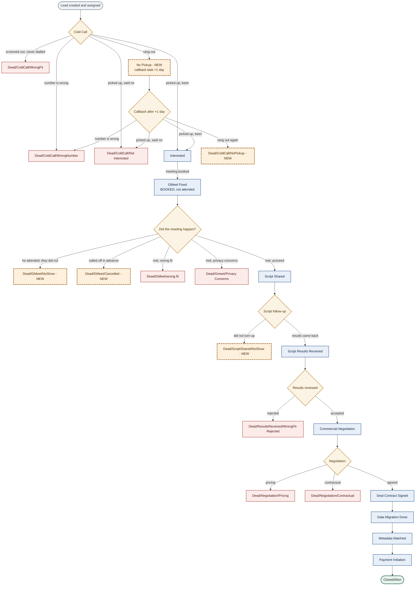

# 2. The funnel flow

## Cold-call half

`Cold Call` forks five ways. The outcomes *are* the next stages.

- **screened out, never dialled** → `Dead/ColdCall/WrongFit`
- **number is wrong** → `Dead/ColdCall/WrongNumber`
- **picked up, said no** → `Dead/ColdCall/Not Interested`
- **picked up, keen** → `Interested`
- **rang out** → `No Pickup`

`No Pickup` is a **live** stage, not a dead end. Landing there logs the attempt and raises a
callback task at **+1 day**. It must not be configured as closed-lost, or those leads leave
the open funnel and the callback never gets worked.

The callback repeats the same four outcomes, with `Dead/ColdCall/NoPickup` as the terminal
when it rings out again. Callback and first-dial outcomes converge on the **same** stages —
they are never duplicated per branch.

`Call Attempted` is retired.

## Post-GMeet half

`GMeet Fixed` means **booked**, not attended. It forks:

- **he attended, they did not** → `Dead/GMeet/NoShow`
- **called off in advance** → `Dead/GMeet/Cancelled`
- **met, wrong fit** → `Dead/GMeet/wrong fit`
- **met, privacy concerns** → `Dead/Gmeet/Privacy Concerns`
- **met, proceed** → `Script Shared`

`Script Shared` then forks to `Dead/ScriptShared/NoShow` or `Script Results Received`.

## Diagram

---
